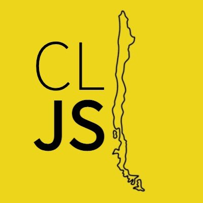

# Repositorio para TechSchool

¡Bienvenidos al repositorio de **TechSchool**!

Este espacio ha sido creado con el objetivo de proporcionar a los estudiantes todos los materiales y archivos necesarios para nuestros talleres. Dentro de este repositorio, encontrarás las carpetas correspondientes a cada uno de los talleres que ofrecemos en nuestros eventos.

**TechSchool** es la evolución de los eventos NodeSchool y es organizado por la comunidad JavaScript Chile. Nuestro primer evento se celebra el [Fecha del Evento, ej: 28 de octubre de 2023] y estamos emocionados de compartir conocimientos y experiencias con todos los participantes.

Te invitamos a explorar las carpetas, descargar el material y prepararte para una experiencia educativa enriquecedora. ¡Nos vemos en TechSchool!

> **Nota:** Esta [versión](https://github.com/fralfaro/techschool) es una adaptación personal del repositorio oficial de [JSConfCL/techschool](https://github.com/JSConfCL/techschool).